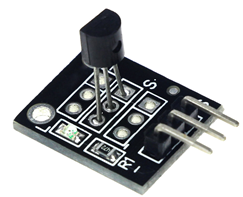
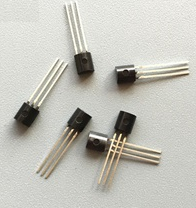
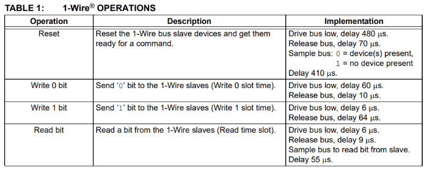
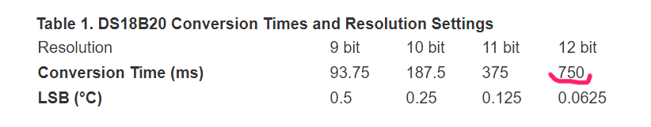
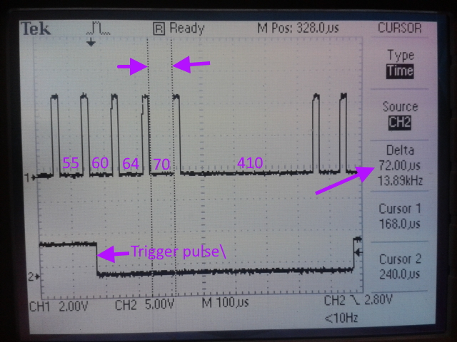
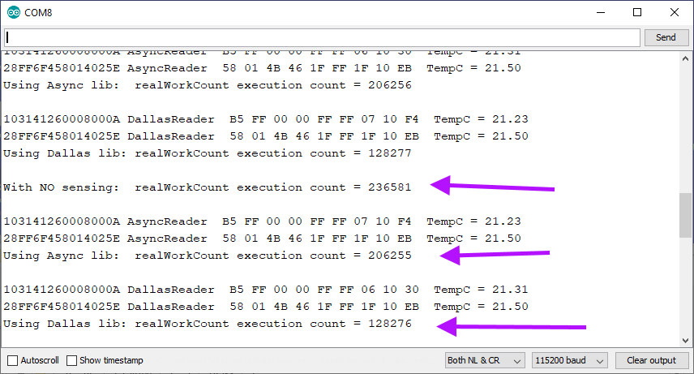

# Background Sensing of 1-Wire DS1820 Temperature Sensors

##  Temperature sensing with Dallas DS1820-type sensors



These little 1-Wire temperature sensors are cheap. One I got as part of a 37-piece sensor kit on a small PCB, with a little blinky light, the others were under US 50c each.  There is quite bit of online discussion about imitation Chinese knock-offs of the genuine Maxim parts.  Or perhaps they are old models, or surplus stock.



Devices using the 1-wire protocol share the single wire bus: 
any device can drive the bus LOW, but when all are idle they present 
a high impedance (open-collector) to the bus, which must then be 
pulled up via a resistor.  
Coordination depends on the Master controlling the slave devices, 
and on timing. 

The four 1-wire operations require long delays. The commonly used OneWire
library on the Arduino makes much use of `delayMicroseconds()`. 
The table below is from http://ww1.microchip.com/downloads/en/appnotes/01199a.pdf. 

At standard wire speeds resetting the bus requires 
three successive wait times of 480us, 70us, and 410us.



But the sensors on the bus can be require even more hectic delays. 
Getting bus devices to all 
simultaneously perform a temperature conversion can require a delay of 
750ms, (yes, millis) before the slowest device might release the bus to indicate 
completion.  Here is a snippet of documentation from
https://www.maximintegrated.com/en/design/technical-documents/app-notes/4/4377.html  



The long conversion times are "by design".  The 
devices have two embedded oscillators: one is designed to 
have a high temperature coefficient, so that its frequency 
changes markedly as the temperature changes. The other reference oscillator is
designed to be as frequency-stable as possible.  Sampling the temperature 
uses the reference oscillator to create a sensing window of precise 
length, while the device counts pulses from the temperature-sensitive 
oscillator. Counting over longer window times gives more accurate estimates.


## My Problem

The key operations I need to repeat - initiate temperature conversion,
and then read the device scratchpad(s) (each 9 bytes, 72 bits)
means the protocol cannot reset the bus, send a device address, and get the scratchpad
value in less than about 10 millisecs, almost all spent blocking, and busy-waiting.
We can't make the wire or the devices go faster.  And for my application I
can't afford to be blocked for such long wait times. 

So I describe here how to drive the protocol through an interpreter 
that runs in the "background", and does not use long busy waits.
This allows my MCU to get on with doing its other work in the meantime.
 
## How It Works

`AsyncTemperatureReader` is a "time-sliced background process" 
on the Arduino (only tested
on a UNO and a MEGA2560). It interprets pseudo instructions. 
Each time the interpreter gets a "timeslice", it does some non-blocking 
steps of the task and then yields with a "holdoff" value indicating 
that it can't do anything 
more until after the holdoff interval has lapsed. Holdoff values are
expressed as a number of tics on `TIMER2`.  

Old-timers might become nostalgic when remembering early 
"non-preemptive multitasking" time-slicing operating systems like
Maximop on ICL mainframes. Whatever is running cannot be premptively 
stopped or interrupted - the running process has to voluntarily 
yield control. 

The interpreter gets its chance to run when its `doTimeslice()` method is called by 
the TIMER2 interrupt service routine.  When the interpreter yields control back
to the ISR caller, it returns a holdoff value that indicates how
long it needs to wait before its 
next timeslice. The ISR sets up new values for the TIMER2 registers to 
achieve the desired holdoff delay.  When the holdoff time has elapsed 
the timer will fire the ISR, and the ISR will pass control to the 
interpreter for its next timeslice.

Pending code or steps to be executed are stored in a bytecode stack.
But some opcodes are macros. When popped off the stack and executed, they can expand
into multiple more primitive instructions in the stack. 
These newly expanded instructions
can also be macros. Each instruction, primitive or macro, may be followed by zero or 
more operands on the stack.

As an example, suppose we request a `ReadScratchPad` operation. 
It expands into instructions or macros in the stack that will eventually 
sequence the operations and delays needed to 
`Reset` the device, `Select` the device by sending the device's addressID,
and then `Read` back the device's scratchpad into a 9-byte buffer 
(supplied by the caller).

Even just reading back the scratchpad requires 72 bit-reads from the sensor. 
From the table above, each bit-read is a sequence of actions that must 
drive the line low, pause, release the line, pause, then sample the line and store the bit, and then pause again for 55us.  

Short pauses are done in the code inline with `_delay_us()`, and won't end the
active timeslice.  But longer pauses end the current timeslice. 
Of course the instruction stack must be 
left in such a state that the next `doTimeslice()` 
call can pick up the flow of logic where the last one left off.

The 1-wire protocol is quite lenient about timing.
The master (that's us) always controls timing on the bus by driving the line low.
then releasing the line to allow the pull-up to pull it high. Then any one of the
attached slave devices can send info back to the master by pulling the shared
bus-line low.  (Slaves must first be addressed and "given the right to use the bus", otherwise they do not talk). Loose protocol timings are acceptable.

This code is very specific for my little sensors. 
So I have not yet catered for the more exotic features like 
Address Search for devices on the bus, CRC checks, parasitic 
power mode, different device resolutions, etc. 
That is left as a homework exercise for someone else :-)

So it's closer to a minimalistic 
"proof of concept" rather than a fully-featured system.

As an aside, you can read about 
the fiendishly clever device discovery algorithm on the bus starting on
page 53 of https://pdfserv.maximintegrated.com/en/an/AN937.pdf 
The 1-Wire protocol with parasitic power is the
communications protocol for the ubiquitous Dallas iButton Chip which has been
around for more than 30 years, and which is still used daily (where I live) for
the petrol-pump jockeys to authenticate themselves before they can pump fuel. 

 

These temperature sensors were originally one 
of the applications embedded in the button.  There is a nice read at
https://www.maximintegrated.com/en/design/blog/iButton.html 


## Under The Hood

The interpreter updates a `status` register as the timeslices run.  
```
const byte Success = 0x00;         // Zero means "ok, all done successfully"
const byte StillBusy = 0x01;
const byte NoDeviceOnBus = 0x02;   // bit set indicates no device on bus
const byte DevicesAreBusy = 0x04;  // waiting for sensor(s) to complete conversions
const byte ChecksumError = 0x08;   // not implemented yet.
```

The user can call a public method to retrieve the status, 
and learn if the requested operation has terminated or failed. 
Because the status code and the scratchpad, etc. are accessed by 
both the main program and the interpreter `doTimeSlice` which is 
called from the TIMER2 ISR, we need to disable interrupts while
accessing the shared variables.
 

```
    byte getStatus()
    {
      byte result;
      nointerrupts();
      result = status;
      interrupts();
      return result;
    }
``` 

The interpreter has 13 different opcodes:

* `BusLow`:      Drive the bus low.
* `BusRelease`: 
Allow the bus to float up to its pull-up value.
* `BusSample`: 
Part of the Reset sequence requires sampling the bus to confirm that there are some devices present.
* `ReadRemainingBits`: 
One-byte opand is bit index position [0..71] where next incoming bit is stored into scratchpad.
* `SendRemainingBits`: 
Two one-byte opands, the bitcount still to be sent, and the byte part still to be sent.
* `SendRemainingIDBytes`: 
One byte opand is index of next ID byte to send. It initiates SendRemainingBits for the next ID byte.
* `WaitForBusRelease`: 
A test-then-yield operation repeatedly executed while waiting for all sensors to complete temperature conversions.
* `ClearBusyStatus`: 
Typically scheduled as the last instruction after the final delay before the interpreter becomes idle.
* `TestTimings`:
Two-byte opand is number of times to still repeat our test timing sequence.
* `ReadScratchPad`: 
Initiates reading of whole scratchpad.  No opand.
* `StartIDSend`: 
After Reset we have to address a specific device by ID in order to read its scratchpad.
* `Reset`: 
Initiates the 1-wire bus Reset.  It needs long delays, achieved here by ending the timeslice.
* `Yield`: 
Ends the current timeslice.  The one byte opand is the number of TIMER2 tics we need to be inactive for.


Bus operations are done using direct port manipulation.  It turned
out that operations like `pinMode(wirePin, INPUT)` and `digitalWrite(wirePin, LOW)`
are slow (4-5us) and relatively unpredictable 
so jumping under the covers was necessary:

```
const byte busPinMask = 0b00010000;
inline void pullBusLow()
{
  DDRB |= busPinMask;     // Set direction for OUTPUT
  PORTB &= ~busPinMask;   // Turn off the port bit to write a LOW
}

inline void releaseBus()
{
  DDRB &= ~busPinMask;   // Set direction for INPUT, i.e. high impedance
}

inline byte sampleBus()
{
  return (PINB & busPinMask) != 0;    // Read value of 1-wire pin.
}

```

The interpreter just repeats a cycle of popping an opcode off the stack 
and dispatching using a switch statement that has one case for each opcode.
The loop is coded to run forever, but the `Yield` opcode gets us out 
when we want the timeslice to end.  

```
    while (true) {

        if (topOfStack == 0) {   // Nothing to do, just keep slowly idling
          return 255;            // Maximum holdoff until next timeslice
        }

        byte opCode = theCode[--topOfStack];  // Grab the next opCode

        switch (opCode) {     // and dispatch to the case statement

          case BusLow:
            {
              pullBusLow();
            }
            break;

          case BusRelease:
            {
              releaseBus();
              _delay_us(10);
            }
            break;

         ... cases for the other 11 opcodes 
        }
    }
```
 


Here is the user-callable function to tell all devices on the bus to do 
a temperature conversion. The code is a bit tricky to read because
the last opcode that is pushed onto the code stack will be 
interpreted first.  So the sequence we need here is to first reset the bus,
then send the wildcard address byte to select all devices, then send the command
telling them all to start their conversions. 

 ```
    void convertAllTemperaturesAsync() {
      nointerrupts();
      flushStack();
      status =  DevicesAreBusy;
      push(WaitForBusRelease);
      pushSendOneByte(STARTCONVO);
      pushSendOneByte(SKIPROMWILDCARD);
      push(Reset);
      interrupts();
    }
```

Our `WaitForBusRelease` opcode samples the bus, and either clears the status bit
to indicate that all devices have finished their temperature conversions. 
If any device is still busy, push an opcode for a future check, and 
yield from the timeslice. 

```
          case WaitForBusRelease:
            { 
              releaseBus();  // unnecessary? 
              int thisBit = sampleBus();
              if (thisBit == 0) // Some device is still holding the bus LOW
              {
                push(WaitForBusRelease);  // Loop around to try again next time.
                YieldFor(255);            // And set the future wake-up call.
              }
              else { // Yay! all devices are ready, 
                     // Clear the waiting status, and get on with other things.
                status &= ~DevicesAreBusy;
              }
            }
            break;
```

Some opCodes also have operands on the stack. 
For example, when we're transmitting a byte of
data, the stack contains the opCode and two parameters: 
the count of bits still to be sent, 
and the remaining bits of the byte that is being sent.  So it looks like this:

```
          case SendRemainingBits: {
              byte bitsToGo = pop();
              byte toSend = pop();
              byte theBitToSend = toSend & 0x01;
              if (--bitsToGo > 0) {
                toSend >>= 1;
                push(toSend);   // Set up the operands for next time
                push(bitsToGo);
                push(SendRemainingBits);  // and schedule to repeat next time
              }
              // Now send the one bit we have to send ...
              if (theBitToSend == 1) {
                // Drive bus low, delay 6 μs.
                // Release bus, delay 64 μs
                pullBusLow();
                _delay_us(6);
                releaseBus();
                YieldFor(Micros64);
              }
              else {
                // Drive bus low, delay 60 μs.
                // Release bus, delay 10 μs.
                pullBusLow();
                push(BusRelease);
                YieldFor(Micros60);
              }
            }
```

## Flattening the Curve

OK.  Probably a bad analogy during a pandemic lockdown.  

How big does the stack of pending work need to be?  Not too big, it turns
out.  It is currently set at 20 bytes. 
I have some diagnostic statements to record the stack high-tide, and it
never gets to more than 17 bytes of usage. This is partially because 
macro expansion happens as late as possible, and I keep operands for state
in the stack. 

So when we need to send 8 bytes of ``deviceID``, I don't
immediately expand that into 8 different byte-send 
operations, or 72 different bit-send operations.  Instead, I 
put a counter and a future opcode on the stack, and schedule just one
byte to be sent. When it completes, the macro will re-execute, pick up its
last count from the stack, and the next byte can be scheduled.  So
the stack stays small. 

## Getting the 1-wire Bus Timings Accurate Enough

As we've seen, the protocol wants a handful of different delay times. These have
to be mapped into `TIMER2` tics which control the intervals.  So we find this in
the code, telling me that a 70us delay is best achieved by waiting for 11 clock
tics.  And so on.  You might notice that there is not really enough resolution
on the 8-bit clock, so two of these protocol delays map to the same 
number of timer tics.  

```
const byte Micros55  = 8;          
const byte Micros60  = 10;   
const byte Micros64  = 10;   
const byte Micros70  = 11;   
const byte Micros410 = 96;   
const byte Micros480 = 110;  
```

`TestTimings` is an opcode for timing validation and diagnostics. 
It has a 16-bit operand for repeating itself (stored in two bytes on the stack). 
It drives the bus LOW, delays via a `Yield`, and then releases the bus. 
It cycles though five different delays. I also toggle another spare digital
line on my Arduino during this sequence.  That gives me a trigger signal for
an oscilloscope, where I can measure how accurate the timings are. 

```
          case TestTimings: {

              releaseBus();      // End the pulse we are measuring

              unsigned int loByte = pop();
              unsigned int hiByte = pop();
              unsigned int toGo = (hiByte << 8) | loByte;

              if (toGo > 1) {
                // Put another TestTimings on the stack for next time.
                toGo--;
                push(toGo >> 8);   // hiByte
                push(toGo & 0xFF); // loByte
                push(TestTimings);
              }

              _delay_us(10);     // Wait a bit before starting the next pulse
              pullBusLow();      // Start the pulse we want to measure

              // This will sequence 5 different timeslice yields. 
              switch (toGo % 5) {  
                case 0:
                  YieldFor(Micros410);
                  break;
                case 1:
                  YieldFor(Micros70);
                  break;
                case 2:
                  YieldFor(Micros64);
                  break;
                case 3:
                  toggleDebugLine();     // Trigger the scope on this one.
                  YieldFor(Micros55);
                  break;
                case 4:
                  YieldFor(Micros55);
                  break;
              }
            }
            break;
```
I've overlayed some magenta onto the photo.  Between the cursors I'm 
seeing 72us for the pulse that was supposed to be 70us. These delays are good enough
for the 1-wire bus. 
 
 


## Results

OK!  Does it work and solve my problem?

This repository contains a test program that assumes two sensors are on the bus.  It 
intiates conversions on all sensors, and then reads each one and prints its scratchpad
content, and converts the scratchpad into degrees Celcius.  But while the background
process is busy, we count the progress on same fake work in the foreground. 

I do the experiment for three scenarios: first with no conversions or 
interaction with 1-wire at all.  This gives me a baseline idea of how much
fake work my Arduino can do in one second.  Then we do conversions using
using this Async lib, we measure again.  Finally we use the Arduino `OneWire` 
and `DallasTemperature` libraries, and see how many work they can complete.  

 
 

Yep, that works for me!  My CPU is still available for other things for about 87% 
of the time.  With the standard libraries that falls to about 54% and there are still
long blocking periods. 

## Limitations, and Still To Do

I don't do everything the other libraries do: no CRC checks, 
no Device Discovery on the bus, no provision for parasitic power mode, cannot
write to the scratchpad or check whether any device has triggered a temperature
limit alert.  

Also, the really cheap devices bias their counts weirdly (or I've not tracked down
the applicable datasheet). I assumed the one that told me my room temperature was
21.5 (this was the one already on a small PCB from the 37-sensor kit) was probably 
more believable than those 
little transistor-looking ones that told me my room was at -52 degrees. 

So I started with `(x0, y0) = (-50, 21.5)`.  I then hung the devices in a kitchen
fan oven and warmed them up until the reference one said it was 100 degrees. 
That gave me `(x1, y1)`.  With two points I assumed a straight line adjustment 
`f(x) = a + bx` was needed.  (I paid attention in school when we were doing
graphs and straight line algebra!) So I back-calculated `a` and `b`.  

I don't have an accurate thermometer to allow better
calibration. The slope of the line is about 1.2, which means that
for every 10 degrees increase that the reference sensor reports, the other sensor
thinks the temperature has only risen by about 8.3 degrees. 

What was noticable is that the device which is attached to the small PCB is more 
sluggish to respond to changes than the ones that are simply dangling on the end of
some wires. I assume that the leads are carrying heat away into the PCB
circuit board, giving that sensor a kind of "heat buffer".   

I'm using these to monitor how hot a power MOSFET gets in another
project. So I've concluded now that any sensor embedded in a 
plastic casing is not 
really ideal for fast-response measurements. They're fine for slow 
environmental sensing, perhaps to turn on a fan or a nice DIY project 
to turn on your peltier cooling module if your beer gets too warm. 
But they're not going to be responsive enough catch a fast rise in 
MOSFET temperatures that tells me something is about to emit its magic 
blue smoke.  


<sub>Last updated:  30 March 2020</sub>


